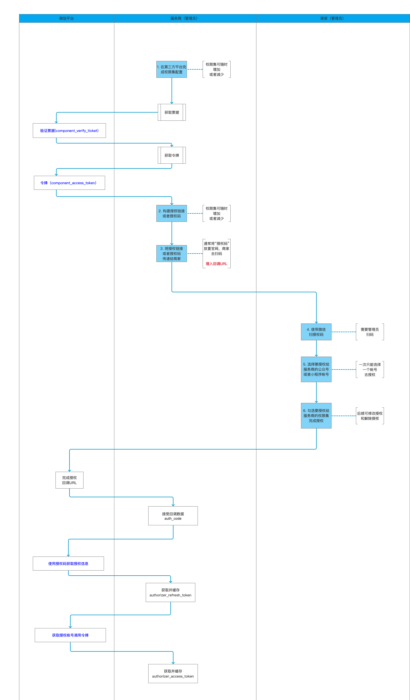
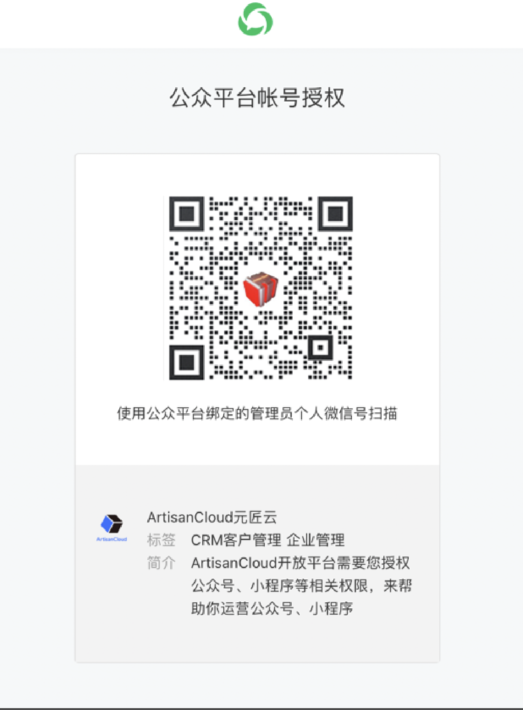

# 授权流程 - 服务商从商家这里获取应用的authorizer_access_token

[查看官方生成授权token的流程文档](https://developers.weixin.qq.com/doc/oplatform/Third-party_Platforms/2.0/api/Before_Develop/creat_token.html)

以下流程，可以通过我们提供的[Tutorial](https://github.com/ArtisanCloud/PowerWechatTutorial)项目来跑通这个授权

## 初始化实例

``` go
// ArtisanCloud/PowerWechatTutorial.git/main.go
OpenPlatformApp, err := openPlatform.NewOpenPlatform(&openPlatform.UserConfig{
  AppID:  "", // 开放平台第三方平台 APPID
  Secret: "", // 开放平台第三方平台 Secret

  Token:  "", // 开放平台第三方平台 Token
  AESKey: "", // 开放平台第三方平台 AES Key

  Log: openPlatform.Log{
    Level: "debug",
    File:  "./wechat.log",
  }, // 日志输出位置
  Cache:     cache, // token缓存
  HttpDebug: true, // 打开后会显示PowerWeChat调用微信API的请求参数和响应结果
  Debug:     false,
})
```

## 授权流程



## 自建授权链接，获取授权令牌的步骤

#### 步骤一

服务商前往微信开放平台 - 第三方平台 - 详情 -
开发配置，完成[权限集与开发资料的配置](https://developers.weixin.qq.com/doc/oplatform/Third-party_Platforms/2.0/operation/authorization/authorization_management.html)
。

#### 步骤二

服务商调用接口获取预授权码（pre_auth_code），接口详情请查看[api_create_preauthcode](https://developers.weixin.qq.com/doc/oplatform/Third-party_Platforms/2.0/api/ThirdParty/token/pre_auth_code.html)

1. [验证票据](https://developers.weixin.qq.com/doc/oplatform/Third-party_Platforms/2.0/api/ThirdParty/token/component_verify_ticket.html)(
   component_verify_ticket)  在第三方平台创建审核通过后，微信服务器会向其 ”授权事件接收URL” 每隔 10 分钟以 POST 的方式推送 component_verify_ticket

|            | 域名                               |
|------------|----------------------------------|
| 登录授权的发起页域名 | 域名：myHost.com/your/callback/uri |
| 授权事件接收配置 | myHost.com/your/callback/uri  |

需要点击"开启推送Ticket"按钮，然后死等推送消息，获取ticket，可以泡杯咖啡。

在你运行的项目中，配置一个回调接口，比如我们这里用APIOpenPlatformPreAuthCode方法，10 mins later,来接受微信推送的ticket消息
```go
// ArtisanCloud/PowerWechatTutorial.git/controllers/open-platform/server.go
func APIOpenPlatformCallback(context *gin.Context) {

  // 打印微信回调回来的xml body
	requestXML, _ := ioutil.ReadAll(context.Request.Body)
	context.Request.Body = ioutil.NopCloser(bytes.NewBuffer(requestXML))
	println(string(requestXML))

	var err error

  // PowerWechat提供的Handle函数，请初始化ervices.OpenPlatformApp，配置好相应的基本参数
	rs, err := services.OpenPlatformApp.Server.Notify(context.Request, func(event *openplatform.Callback, decrypted []byte, infoType string) (result interface{}) {

		result = kernel.SUCCESS_EMPTY_RESPONSE

		switch infoType {
		case openplatform.EVENT_COMPONENT_VERIFY_TICKET:
			msg := &openplatform.EventVerifyTicket{}
			err = xml.Unmarshal(decrypted, msg)
			//fmt.Dump(event)
			if err != nil {
				return err
			}
			// 在获取ComponentVerifyTicket后，可以直接通过SetTicket，保存在缓存中
			err = services.OpenPlatformApp.VerifyTicket.SetTicket(msg.ComponentVerifyTicket)
			if err != nil {
				return err
			}

			fmt.Dump(msg)
		case openplatform.EVENT_AUTHORIZED:
		default:
		}
		return result
	})

	if err != nil {
		panic(err)
	}

	err = rs.Write(context.Writer)
	if err != nil {
		panic(err)
	}

}

```
注意：
> component_verify_ticket 的有效时间为12小时，比 component_access_token 更长，建议保存最近可用的component_verify_ticket，在 component_access_token 过期之前都可以直接使用该 component_verify_ticket 进行更新，避免出现因为 component_verify_ticket 接收失败而无法更新 component_access_token 的情况

> component_verify_ticket是会失效，所以上生产，需要一直开着推送ticket，推送给你的回调服务器，这样可以一直缓存你的component_verify_ticket
> 保证后面的authorizer_refresh_token可以正常使用。


2. [获取令牌](https://developers.weixin.qq.com/doc/oplatform/Third-party_Platforms/2.0/api/ThirdParty/token/component_access_token.html)
   （component_access_token） 令牌的获取是有限制的，每个令牌的有效期为 2 小时，请自行做好令牌的管理，在令牌快过期时（比如1小时50分），重新调用接口获取。
> 这一步PowerWechat会封装在Middleware里，自动获取，并且缓存下来，你只需要在初始化OpenPlatform对象时，配置好相关参数就行

3. [获取预授权码](https://developers.weixin.qq.com/doc/oplatform/Third-party_Platforms/2.0/api/ThirdParty/token/pre_auth_code.html)
   （pre_auth_code）

```go
// ArtisanCloud/PowerWechatTutorial.git/controllers/open-platform/open-platform.go
func APIOpenPlatformPreAuthCode(ctx *gin.Context) {

	rs, err := services.OpenPlatformApp.Base.CreatePreAuthorizationCode(ctx.Request.Context())
	if err != nil {
		panic(err)
	}
	fmt.Dump(rs)
}
```

#### 步骤三

如果之前没有对小程序或公众号进行过授权，需要 准备“授权回调 URI”，然后按照官方文档规则生成 PC 端的授权二维码或者移动端的授权链接，详情请看下方说明

* 授权链接参数说明

| 参数                      |  必填      | 说明                                                                                                                                |
|-------------------------|------------|-----------------------------------------------------------------------------------------------------------------------------------|
| component_appid         |    是      | 第三方平台方 appid                                                                                                                      |
| pre_auth_code           |    是      | 预授权码                                                                                                                              |
| redirect_uri           |    是      | - 授权回调 URI(填写格式为https://xxx)。（插件版无该参数）   <br/>- 管理员授权确认之后会自动跳转进入回调 URI，并在 URL 参数中返回授权码和过期时间(redirect_url?auth_code=xxx&expires_in=600) |
| auth_type           |    是      | - 要授权的帐号类型，即商家点击授权链接或者扫了授权码之后，展示在用户手机端的授权帐号类型。<br/>- 1 表示手机端仅展示公众号；2 表示仅展示小程序，3 表示公众号和小程序都展示。如果为未指定，则默认小程序和公众号都展示。<br/>- 第三方平台开发者可以使用本字段来控制授权的帐号类型。<br/>- 对于已经注销、冻结、封禁、以及未完成注册的帐号不再出现于授权帐号列表。                                                                                                                             |
| biz_appid           |    否      | - 指定授权唯一的小程序或公众号 。 <br/>- 如果指定了appid，则只能是该 appid 的管理员进行授权，其他用户扫码会出现报错。<br/>- auth_type、biz_appid 两个字段如果设置的信息冲突，则biz_appid生效的优先级更高。<br/>- 例如，auth_type=1，但是biz_appid是小程序的appid，则会按照auth_type=2来处理，即以biz_appid的类型为准去拉出来对应的权限集列表.                                                                                                                   |
| category_id_list           |    否      | - 指定的权限集 id 列表，如果不指定，则默认拉取当前第三方账号已经全网发布的权限集列表。<br/>- 如需要指定单个权限集ID，写法为“category_id_list=99” ，如果有多个权限集，则权限集 id 与id之间用中竖线隔开。                                                                                                                              |

* 授权链接拼接方式

| 版本             | 使用场景                                                                                                                                                                                     |
| --------------  | ----------------------------------------------------------------------------------------------------------------------------------------------------------------------------------------------|
| PC版            | https://mp.weixin.qq.com/cgi-bin/componentloginpage?component_appid=xxxx&pre_auth_code=xxxxx&redirect_uri=xxxx&auth_type=xxx                                                                 |
| H5版-新版        | https://open.weixin.qq.com/wxaopen/safe/bindcomponent?action=bindcomponent&no_scan=1&component_appid=xxxx&pre_auth_code=xxxxx&redirect_uri=xxxx&auth_type=xxx&biz_appid=xxxx#wechat_redirect |
| H5版-旧版        | https://mp.weixin.qq.com/safe/bindcomponent?action=bindcomponent&no_scan=1&component_appid=xxxx&pre_auth_code=xxxxx&redirect_uri=xxxx&auth_type=xxx&biz_appid=xxxx#wechat_redirect           |


```go
// ArtisanCloud/PowerWechatTutorial.git/controllers/open-platform/open-platform.go
func GetFastRegistrationURL(ctx *gin.Context) {

	url := services.OpenPlatformApp.GetFastRegistrationURL(ctx.Request.Context(), "https://michael.debug.artisancloud.cn/auth", &object.StringMap{
		"auth_type": "1",
	})

	fmt.Dump(url)
}

```

> 记得需要在页面里使用这个url，不能直接在浏览器里打开这个url，否则会报错

#### 步骤四
公众号/小程序管理员扫码或者访问移动端授权链接，确认同意授权给第三方平台。（如果该第三方平台帐号尚未全网发布，则需要先将要用于测试的公众号或者小程序加入第三方平台 - 开发资料的“授权测试公众号/小程序列表”。）




#### 步骤五
管理员授权确认之后，授权页会自动跳转进入回调 URI，并在 URL 参数中返回授权码和过期时间(
redirect_url?auth_code=xxx&expires_in=600)。

```go
// ArtisanCloud/PowerWechatTutorial.git/routes/open-platform
apiRouter.GET("/auth", open_platform.HandleAuthorize)

// ArtisanCloud/PowerWechatTutorial.git/controllers/open-platform/open-platform.go
// HandleAuthorize Code换调用凭据信息
func HandleAuthorize(ctx *gin.Context) {
	authCode := ctx.DefaultQuery("authCode", "")
	res, err := services.OpenPlatformApp.Base.HandleAuthorize(ctx.Request.Context(), authCode)
	if err != nil {
		panic(err)
	}
	ctx.JSON(200, res)
}

```

#### 步骤六
调用接口生成[authorizer_access_token](https://developers.weixin.qq.com/doc/oplatform/openApi/OpenApiDoc/ticket-token/getAuthorizerAccessToken.html)，然后以该 token 调用公众号或小程序的相关 API。
1. [使用授权码获取授权信息](https://developers.weixin.qq.com/doc/oplatform/Third-party_Platforms/2.0/api/ThirdParty/token/authorization_info.html)  
当用户在第三方平台授权页中完成授权流程后，第三方平台开发者可以在回调 URI 中通过 URL 参数获取授权码。使用以下接口可以换取公众号/小程序的授权信息。  
> 建议保存授权信息中的刷新令牌(authorizer_refresh_token)
2. [获取授权帐号调用令牌](https://developers.weixin.qq.com/doc/oplatform/openApi/OpenApiDoc/ticket-token/getAuthorizerAccessToken.html)
该接口用于获取授权帐号的authorizer_access_token。  
authorizer_access_token 有效期为 2 小时，authorizer_access_token 失效时，可以使用 authorizer_refresh_token 
> 获取新的 authorizer_access_token，并且缓存。
