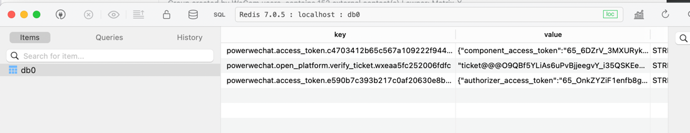

# 代授权方实现业务

> 授权方已经把公众号、小程序授权给你的开放平台第三方平台了，接下来的代授权方实现业务只需一行代码即可获得授权方实例。

也请查阅微信规定的 [接口权限说明](https://developers.weixin.qq.com/doc/offiaccount/Getting_Started/Explanation_of_interface_privileges.html)

## 获取授权方实例

``` go
officialAccount, err := services.OpenPlatformApp.OfficialAccount(appID, refreshToken, nil)
miniProgram, err := services.OpenPlatformApp.MiniProgram(appID, refreshToken, nil)
```

> appID 为授权方公众号 APPID，非开放平台第三方平台 APPID  
> refreshToken 为授权方的 refresh_token

## 帮助授权方管理开放平台账号 

``` go
// 代公众号实现业务
account := officialAccount.Account
// 代小程序实现业务
account := miniProgram.Account

// 创建开放平台账号
result, err := account.Create()

// 并绑定公众号或小程序
// 将公众号或小程序绑定到指定开放平台帐号下
result, err := account.BindTo(openAppID)

// 将公众号或小程序从指定开放平台帐号下解绑
result, err := account.UnbindFrom(openAppID)

// 获取开放平台帐号下绑定的公众号或小程序
result, err := account.GetBinding()

```
> 授权第三方平台注册的开放平台帐号只可用于获取用户 unionid 实现用户身份打通。  
> 第三方平台不可操作（包括绑定/解绑）通过 open.weixin.qq.com 线上流程注册的开放平台帐号。  
> 公众号只可将此权限集授权给一个第三方平台，授权互斥。


接下来的 API 调用等操作和公众号、小程序的开发一致，请移步到公众号或小程序开发章节继续进行开发吧。

## 代码示例

```go
// ArtisanCloud/PowerWechatTutorial.git/controllers/open-platform/authorizer-delegate.go
// GetAuthorizerOfficialAccount 获取授权方实例 - 公众号
func GetAuthorizerOfficialAccount(ctx *gin.Context) {
	appID := ctx.DefaultQuery("app_id", "")
	refreshToken := ctx.DefaultQuery("refresh_token", "")
	if appID == "" || refreshToken == "" {
		panic("app_id or refresh_token is empty ")
	}
	officialAccount, err := services.OpenPlatformApp.OfficialAccount(appID, refreshToken, nil)
	if err != nil {
		panic(err)
	}
	ipList, err := officialAccount.OfficialAccount.Base.GetCallbackIP(ctx)
	if err != nil {
		panic(err)
	}
	ctx.JSON(http.StatusOK, gin.H{"msg": "success", "data": ipList})

}
```

``` go
miniProgram, err := OpenPlatformApp.MiniProgram("[appID]", "[refreshToken]", nil)
if err != nil {
  panic(err)
}
// 根据 code 获取 session
data, err := miniProgram.Auth.Session("[code]")
if err != nil {
  panic(err)
}
ctx.JSON(http.StatusOK, gin.H{"msg": "success", "data": data})
```


## 缓存中的token截图示例：

ipList

## 使用示例

参考: [PowerWechatTutorial](https://github.com/ArtisanCloud/PowerWechatTutorial/blob/master/controllers/open-platform/authorizer-delegate.go)
