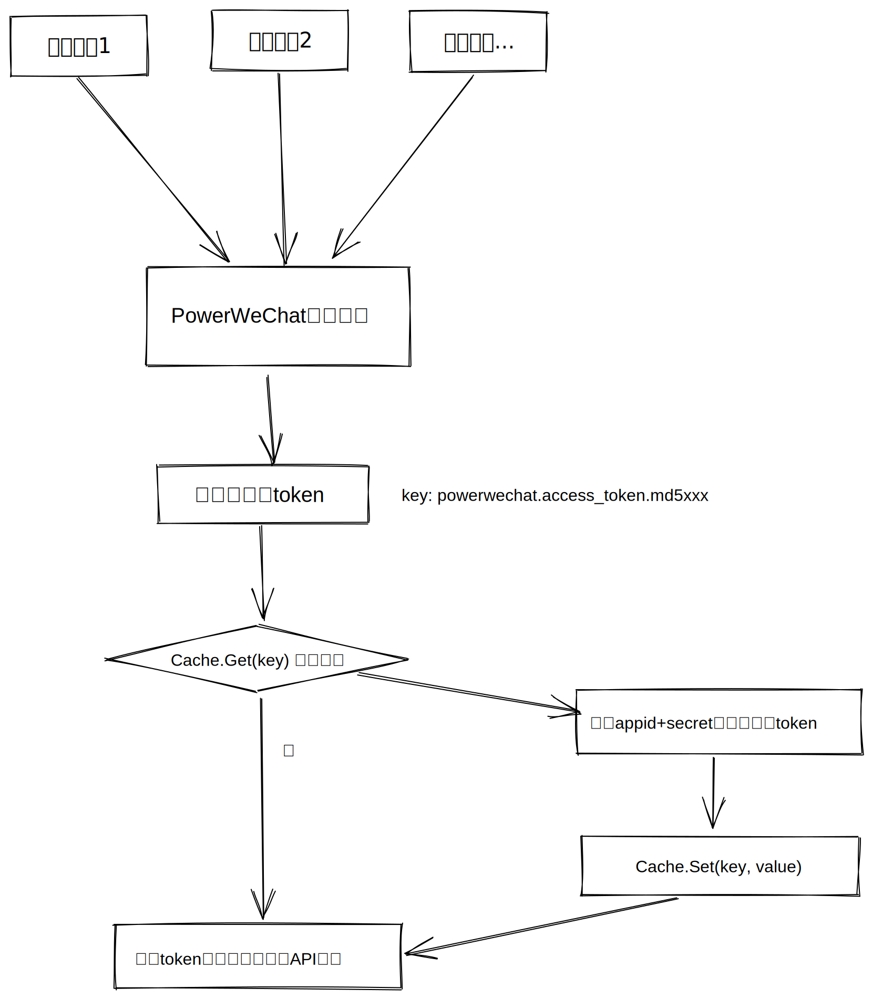

# 通用配置

## Cache配置

PowerWeChat考虑到大家存在集群部署或者和其他应用环境共享Token令牌的需求，所以将在Config中提供了**Cache**配置。

我们提供了以下选择：

1.  选择不配置。默认就会存储在程序的运行内存空间，重启之后需要重新获取。不推荐在生产环境使用。 
2.  选择配置到PowerWeChat实现redis，这样不同的实例能够共享一份缓存 (**强烈推荐**)
3.  选择自定义Cache。用户可能需要自己实现Cache，例如实现db共享或者在别的服务已经提供了Token中控。

#### 方式一、 默认程序内存

什么都不用配置。

#### 方式二、powerwechat提供redis中控

我们找了一个企业微信的初始化代码代码作为参考。具体用法可以打开[PowerWeChat Toturial](https://github.com/ArtisanCloud/power-wechat-tutorial/blob/master/services/payment-service.go)。

``` go
import (  
 "github.com/ArtisanCloud/PowerWeChat/v3/src/kernel"  
 "github.com/ArtisanCloud/PowerWeChat/v3/src/work"
 "power-wechat-tutorial/config"
)
func NewWeComContactService(conf *config.Configuration) (*work.Work, error) {
  app, err := work.NewWork(&work.UserConfig{
    // ...
    Cache: kernel.NewRedisClient(&kernel.UniversalOptions{
      Addrs:     []string{"127.0.0.1:6379"},
      Password: "",
      DB:       0,
    }),
  })
  return app, err
}

```

参数配置基本上和go-redis是一样的。当前PowerWeChat走的是懒加载模式，也就是只有业务请求需要用到token了才会去加载刷新。

::: tip
小提示，如果遇到了redis抛这出下面这种错误：

MISCONF Redis is configured to save RDB snapshots, but it is currently not able to persist on disk. Commands that may modify the data set are disabled, because this instance is configured to report errors during writes if RDB snapshotting fails (stop-writes-on-bgsave-error option). Please check the Redis logs for details about the RDB error

那么你可以进入到redis-cli里面，执行一下config set stop-writes-on-bgsave-error no。
参考链接：[stackoverflow](https://stackoverflow.com/questions/19581059/misconf-redis-is-configured-to-save-rdb-snapshots)
:::

#### 方案三、自定义Cache

我们Cache字段接受`CacheInterface` 类型，只要将下面这些方法实现传给Cache即可。

```go
type CacheInterface interface {
 Get(key string, defaultValue interface{}) (ptrValue interface{}, err error)
 Set(key string, value interface{}, expires time.Duration) error
 Has(key string) bool
 AddNX(key string, value interface{}, ttl time.Duration) bool
 Add(key string, value interface{}, ttl time.Duration) (err error)
 Remember(key string, ttl time.Duration, callback func() interface{}) (obj interface{}, err error)
}
```

在使用这个方案之前，我们先要通过流程图了解一下PowerWeChat的Cache工作机制。



通过流程图我们可以看到，PowerWeChat每次都会执行Cache.Get，而Cache.Set只会在没有值的时候重新获取并设置。

这里已经可以满足两个以下自定义场景：

1. Token刷新和获取都是PowerWeChat维护。使用者需要存储在其他地方，例如： mysql、postgresql、Memcached等，那么您将Cache.Get和Cache.Set两者都实现即可。
2. Token获取和刷新是由别的程序维护，您只要实现Cache.Get操作逻辑即可，Cache.Set可以继续留空。

#### 实现自定义Cache Key：

虽然目前我们只缓存了access_token，但未来我们可能会加入更多的一些数据到cache里

您需要保持统一的cache key算法，才能让PowerWeChat正确读取到cache中的数据，我们下面以缓存access_token为例：

1. 使用appid和secret进行字符串拼接。例如: appid=testappid; secret=testsecret, 那么结果为: testappidtestsecret
2. 计算字符串的md5。"testappidtestsecret" 的md5值为 "edc5f6181730baffc0b88cf96658aeff"
3. 加上PowerWeChat前缀命名空间："powerwechat.access_token."
4. 最终结果access_token的cache key为："powerwechat.access_token.edc5f6181730baffc0b88cf96658aeff"

同时，cache value里面是一个json字符串：

```json
"{\"access_token\":\"X9a0AH0LhQCjgPi5_AY5HV2cQLPXngS0gmjLdn8Up_CZcsP6PFaod_xRVGhqVjgsYsERCJ0XNHR43i8VuLLnsyXwh2dxSna1Pj7KOdu5RBpq75SMpGTYfA5a3QlhJLiQ1hHa0vjuwi4KasRtGjHx3298Xdeo2mr7YmVQWhVfh7sQBwVpfAUxw7vTGN4QxXSyxKTxhINSGGT8O2SZOF1CHg\",\"expires_in\":7200}"

// redis-cli 打印结果
// ➜  ~ redis-cli
// 127.0.0.1:6379> keys *
// 1) "powerwechat.access_token.d41d8cd98f00b204e9800998ecf8427e"
// 127.0.0.1:6379> get powerwechat.access_token.d41d8cd98f00b204e9800998ecf8427e
// "{\"access_token\":\"X9a0AH0LhQCjgPi5_AY5HV2cQLPXngS0gmjLdn8Up_CZcsP6PFaod_xRVGhqVjgsYsERCJ0XNHR43i8VuLLnsyXwh2dxSna1Pj7KOdu5RBpq75SMpGTYfA5a3QlhJLiQ1hHa0vjuwi4KasRtGjHx3298Xdeo2mr7YmVQWhVfh7sQBwVpfAUxw7vTGN4QxXSyxKTxhINSGGT8O2SZOF1CHg\",\"expires_in\":7200}"
```

PowerWeChat当前会将access_token的cache value按照下面结构来解析，后面可能会扩展其他的字段：

```go
type T struct {
	AccessToken string `json:"access_token"`
	ExpiresIn   int    `json:"expires_in"`
}
```

#### 实现参考

我们已经实现了redis和memory两种cache模块，如果需要PowerWeChat来支持更多的类型，都可以与我们联系：

1. [memory](https://github.com/ArtisanCloud/PowerLibs/blob/master/cache/memory.go)
2. [redis](https://github.com/ArtisanCloud/PowerLibs/blob/master/cache/redis.go)


## 日志配置

PowerWeChat提供了日志模块，默认情况下，日志会输出到控制台。如果需要输出到文件，可以配置如下：

```go

Log: work.Log{
		    Level: "debug",
			File:  "./wechat.log",
		},

```
### 路径
自定义File，可以指定输出路径，默认路径是项目根目录下:  

./wechat/info.log  
./wechat/error.log

### 自定义Log

PowerWeChat提供了自定义日志模块，可以自定义日志格式、输出等。

```go

import (
	"github.com/ArtisanCloud/PowerLibs/v3/logger/drivers"
    ....
)

Log: miniProgram.Log{
			Driver: &drivers.SimpleLogger{},
			Level:  "debug",
			File:   "./wechat_info.log",
			Error:   "./wechat_error.log",
		},
		
```

定义了Log的Interface，如下：
    
```go
package contract

const (
DebugLevel   int8 = 0
InfoLevel    int8 = 1
WarningLevel int8 = 2
ErrorLevel   int8 = 3
PanicLevel   int8 = 4
FatalLevel   int8 = 5
)

type LoggerInterface interface {
Debug(msg string, v ...interface{})
Info(msg string, v ...interface{})
Warn(msg string, v ...interface{})
Error(msg string, v ...interface{})
Panic(msg string, v ...interface{})
Fatal(msg string, v ...interface{})

DebugF(format string, args ...interface{})
InfoF(format string, args ...interface{})
WarnF(format string, args ...interface{})
ErrorF(format string, args ...interface{})
PanicF(format string, args ...interface{})
FatalF(format string, args ...interface{})

//Log( level int8, msg string, objs ...interface{})
//Logf( format string, v ...interface{})
}

```

### 关闭日志
```go

import (
	"github.com/ArtisanCloud/PowerLibs/v3/logger/drivers"
    ....
)

Log: miniProgram.Log{
			Driver: &drivers.DummyLogger{},
		},
		
```
