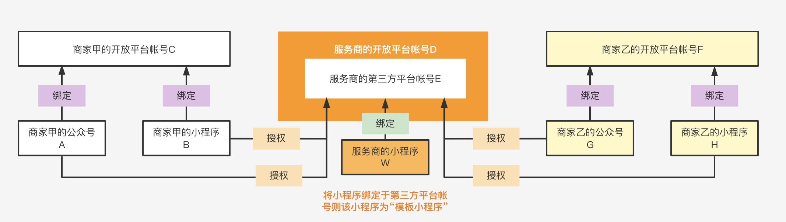
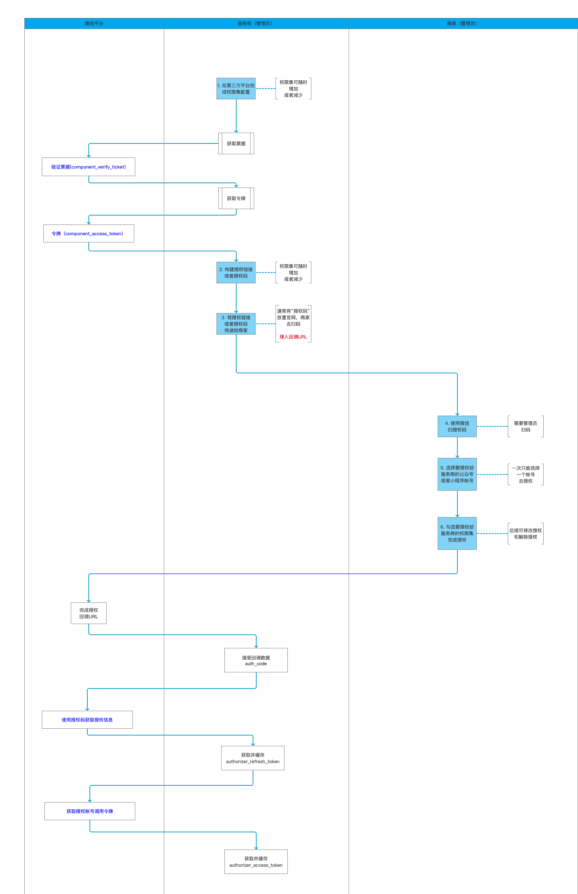
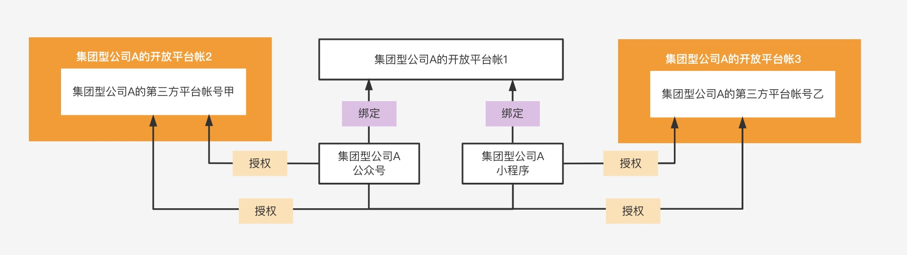

# 应用场景

## 场景一：商家委托服务商代运营小程序和公众号业务应用

### 目的

商家需要一家专业的微信服务商，帮助商家统一代运营小程序，公众号业务

请参考官方图解：

### 前置条件：

* 商家需要有自己的开放平台
* 商家的小程序和公众号，必须是绑定在商家自己的开放平台账号
* 商家将自己开放平台绑定的小程序和公众号，必须将其业务功能权限，以授权的方式，给到服务商的开放平台账号下，对应的第三方平台账号使用

### 注意要点：

* 服务商需要帮助商家开通商家开放平台，不能直接用服务商的开放平台去绑定商家的小程序和公众号
* 服务商可以通过api的方式，程序化的帮助商家开通商家开放平台

### 授权流程

### 自建授权链接

#### 步骤一

服务商前往微信开放平台 - 第三方平台 - 详情 -
开发配置，完成[权限集与开发资料的配置](https://developers.weixin.qq.com/doc/oplatform/Third-party_Platforms/2.0/operation/authorization/authorization_management.html)
。

#### 步骤二

服务商调用接口获取预授权码（pre_auth_code），接口详情请查看[api_create_preauthcode](https://developers.weixin.qq.com/doc/oplatform/Third-party_Platforms/2.0/api/ThirdParty/token/pre_auth_code.html)

1. [验证票据](https://developers.weixin.qq.com/doc/oplatform/Third-party_Platforms/2.0/api/ThirdParty/token/component_verify_ticket.html)(
   component_verify_ticket)
2. [获取令牌](https://developers.weixin.qq.com/doc/oplatform/Third-party_Platforms/2.0/api/ThirdParty/token/component_access_token.html)
   （component_access_token）
3. [获取预授权码](https://developers.weixin.qq.com/doc/oplatform/Third-party_Platforms/2.0/api/ThirdParty/token/pre_auth_code.html)
   （pre_auth_code）

#### 步骤三

准备“授权回调 URI”，然后按照官方文档规则生成 PC 端的授权二维码或者移动端的授权链接，详情请看下方说明

* 授权链接参数说明

| 参数                      |  必填      | 说明                                                                                                                                |
|-------------------------|------------|-----------------------------------------------------------------------------------------------------------------------------------|
| component_appid         |    是      | 第三方平台方 appid                                                                                                                      |
| pre_auth_code           |    是      | 预授权码                                                                                                                              |
| redirect_uri           |    是      | - 授权回调 URI(填写格式为https://xxx)。（插件版无该参数）    - 管理员授权确认之后会自动跳转进入回调 URI，并在 URL 参数中返回授权码和过期时间(redirect_url?auth_code=xxx&expires_in=600) |
| auth_type           |    是      | - 要授权的帐号类型，即商家点击授权链接或者扫了授权码之后，展示在用户手机端的授权帐号类型。 - 1 表示手机端仅展示公众号；2 表示仅展示小程序，3 表示公众号和小程序都展示。如果为未指定，则默认小程序和公众号都展示。 - 第三方平台开发者可以使用本字段来控制授权的帐号类型。 - 对于已经注销、冻结、封禁、以及未完成注册的帐号不再出现于授权帐号列表。                                                                                                                             |
| biz_appid           |    否      | - 指定授权唯一的小程序或公众号 。  - 如果指定了appid，则只能是该 appid 的管理员进行授权，其他用户扫码会出现报错。 - auth_type、biz_appid 两个字段如果设置的信息冲突，则biz_appid生效的优先级更高。 - 例如，auth_type=1，但是biz_appid是小程序的appid，则会按照auth_type=2来处理，即以biz_appid的类型为准去拉出来对应的权限集列表.                                                                                                                   |
| category_id_list           |    否      | - 指定的权限集 id 列表，如果不指定，则默认拉取当前第三方账号已经全网发布的权限集列表。 - 如需要指定单个权限集ID，写法为“category_id_list=99” ，如果有多个权限集，则权限集 id 与id之间用中竖线隔开。                                                                                                                              |

* 授权链接拼接方式

| 版本             | 使用场景                                                                                                                                                                                     |
| --------------  | ----------------------------------------------------------------------------------------------------------------------------------------------------------------------------------------------|
| PC版            | https://mp.weixin.qq.com/cgi-bin/componentloginpage?component_appid=xxxx&pre_auth_code=xxxxx&redirect_uri=xxxx&auth_type=xxx                                                                 |
| H5版-新版        | https://open.weixin.qq.com/wxaopen/safe/bindcomponent?action=bindcomponent&no_scan=1&component_appid=xxxx&pre_auth_code=xxxxx&redirect_uri=xxxx&auth_type=xxx&biz_appid=xxxx#wechat_redirect |
| H5版-旧版        | https://mp.weixin.qq.com/safe/bindcomponent?action=bindcomponent&no_scan=1&component_appid=xxxx&pre_auth_code=xxxxx&redirect_uri=xxxx&auth_type=xxx&biz_appid=xxxx#wechat_redirect           |

#### 步骤四
公众号/小程序管理员扫码或者访问移动端授权链接，确认同意授权给第三方平台。（如果该第三方平台帐号尚未全网发布，则需要先将要用于测试的公众号或者小程序加入第三方平台 - 开发资料的“授权测试公众号/小程序列表”。）

#### 步骤五
管理员授权确认之后，授权页会自动跳转进入回调 URI，并在 URL 参数中返回授权码和过期时间(
redirect_url?auth_code=xxx&expires_in=600)。

#### 步骤六
调用接口生成[authorizer_access_token](https://developers.weixin.qq.com/doc/oplatform/openApi/OpenApiDoc/ticket-token/getAuthorizerAccessToken.html)，然后以该 token 调用公众号或小程序的相关 API。
1. [使用授权码获取授权信息](https://developers.weixin.qq.com/doc/oplatform/Third-party_Platforms/2.0/api/ThirdParty/token/authorization_info.html)  
当用户在第三方平台授权页中完成授权流程后，第三方平台开发者可以在回调 URI 中通过 URL 参数获取授权码。使用以下接口可以换取公众号/小程序的授权信息。  
建议保存授权信息中的刷新令牌(authorizer_refresh_token)
2. [获取授权帐号调用令牌](https://developers.weixin.qq.com/doc/oplatform/openApi/OpenApiDoc/ticket-token/getAuthorizerAccessToken.html)
该接口用于获取授权帐号的authorizer_access_token。  
authorizer_access_token 有效期为 2 小时，authorizer_access_token 失效时，可以使用 authorizer_refresh_token 获取新的 authorizer_access_token。

[查看官方使用API生成授权token的流程文档](https://developers.weixin.qq.com/doc/oplatform/Third-party_Platforms/2.0/api/Before_Develop/creat_token.html)

## 场景二：商家自己开设多个开放平台账号，统一运营多个小程序和公众号业务

### 目的

对于一些集团型的企业，申请第三方平台是为了服务集团内的公众号和小程序。对于同一公司的公众号和小程序有身份打通的需求，即需要将公众号和小程序挂到同一个开放平台帐号下

由于集团公司业务复杂性，会申请多个第三方平台帐号（即会有多个开放平台帐号）。这种情况下，开发者只需要将所有的公众号和小程序绑到一个开放平台帐号即可，多申请的开放平台帐号不需要再绑定任何的公众号和小程序，只是用来创建第三方平台帐号即可。大概的结构图如下：

### 前置条件：

* 商家需要开多个开放平台，所要开的多个开放平台，属于同一家公司机构
* 多个开放平台下需要开设一个第三方平台账号，来对应同一个开放平台账号。

[//]: # (## 场景三：商家自己运营小程序，公众号业务)

[//]: # (目的：商家可以通过开通自己的开放平台账号，来实现打通获取小程序或公众号的整体运营场景)

[//]: # ()

[//]: # (![]&#40;images/scene1.jpg&#41;)

[//]: # ()

[//]: # (前置条件：)

[//]: # (* 商家需要有自己的开放平台)

[//]: # (* 商家的小程序和公众号，必须是绑定在商家自己的开放平台账号)
